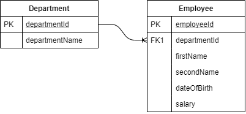
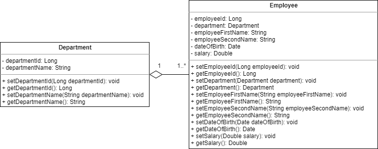

# Software Requirements Specification
## For epam_project

Version 0.1  
Prepared by Kiselevich Alexander  

Table of Contents
=================
* 1 [Introduction](#1-introduction)
  * 1.1 [Document Purpose](#11-document-purpose)
  * 1.2 [Product Scope](#12-product-scope)
  * 1.3 [Definitions, Acronyms and Abbreviations](#13-definitions-acronyms-and-abbreviations)
  * 1.4 [References](#14-references)
* 2 [Product Overview](#2-product-overview)
  * 2.1 [Product Perspective](#21-product-perspective)
  * 2.2 [Product Functions](#22-product-functions)
  * 2.3 [Product Constraints](#23-product-constraints)
  * 2.4 [User Characteristics](#24-user-characteristics)
  * 2.5 [Assumptions and Dependencies](#25-assumptions-and-dependencies)
* 3 [Requirements](#3-requirements)
  * 3.1 [External Interfaces](#31-external-interfaces)
    * 3.1.1 [User Interfaces](#311-user-interfaces)
    * 3.1.2 [Hardware Interfaces](#312-hardware-interfaces)
    * 3.1.3 [Software Interfaces](#313-software-interfaces)
  * 3.2 [Functional](#32-functional)

## 1. Introduction

### 1.1 Document Purpose
This SRS describes the software functional and nonfunctional requirements for Human resource management system. This document is intended to be used by the members of the project team that will implement and verify the correct functioning of the system.

### 1.2 Product Scope
Human resource management system allows you to manage the affiliation of personnel to a particular department. It should have only two entities: “Department” and “Employee”, related as one to many.

### 1.3 Definitions, Acronyms and Abbreviations
MVC -(Model-View-Controller) MVC is an application design model comprised of three interconnected parts. They include the model (data), the view (user interface), and the controller (processes that handle input).  
REST-request - Representational state transfer (REST) is a software architectural style that defines a set of constraints to be used for creating Web services. Web services that conform to the REST architectural style, called RESTful Web services, provide interoperability between computer systems on the Internet. RESTful Web services allow the requesting systems to access and manipulate textual representations of Web resources by using a uniform and predefined set of stateless operations.  
CRUD operations - Create, read, update, delete.

### 1.4 References

## 2. Product Overview

### 2.1 Product Perspective
This is a simple human resource management system that allows you to interact with two entities: "Department" and "Employee". Database Organization Scheme:  

### 2.2 Product Functions
Functions available to the user:  

* Creation of a new department.  
* View department information.  
* Editing department information.  
* Deleting department information.  
* Create a new employee.  
* View employee information.  
* Editing employee information.  
* Delete employee information.  

### 2.3 Product Constraints
Developing application should be based on the MVC architectural pattern in Java, run on Apache Tomcat and run in a browser.

### 2.4 User Characteristics
Entity class diagram:

### 2.5 Assumptions and Dependencies
Dependencies:  

* mysql-connector-java   

## 3. Requirements

### 3.1 External Interfaces
When entering the department name in the departmentName field, when creating information about the new department, only Latin and numbers should be used. Example: "department1"  
When entering the date of birth in the dateOfBirth field when creating or editing information about the employee, the input format should be as follows: DD-MM-YYYY. Example: "15-02-2000"  
When you enter a salary in the salary field when creating or editing employee information, the number must be a positive real number. Example: "255.04"  

#### 3.1.1 User interfaces
> will be after step 6

#### 3.1.2 Hardware interfaces
The interaction between the user interface and the server will be carried out using rest requests. Data will come in JSON format.

#### 3.1.3 Software interfaces
The application must be running on the Tomcat server. Use MySQL as a database. Use Java programming language and Spring Framework. To build the project use Maven. For version control use Git.

### 3.2 Functional  
* **Creation of a new department.**  
The user fills out a form to create information about the new department and presses the confirm button. A POST request is sent to the server, and data is validated. if the data is correct a new record is created in the database.  
* **View department information.**  
When you enter the form to view information about the departments, a GET - request is sent to the server. The server sends information in JSON format in response. Information is filled in on the form.  
* **Editing department information.**  
The user fills out a form for editing department information and clicks on the confirm button. A PUT - request is sent to the server and the data is validated. if the data is correct, the record in the database is edited.  
* **Deleting department information.**  
The user enters the departmentId of the department which information he wants to delete. Presses the confirm button. A DELETE - request is sent to the server. The server is checking departmentId. If information about this department exists, it will be deleted; if information about this department does not exist, the server will return a message about incorrect data.  
* **Create a new employee.**  
The user fills out a form to create information about a new employee and clicks the confirm button. A POST - request is sent to the server, and the data is verified. If the data is correct, a new record is created in the database.  
* **View employee information.**  
When you enter the form to view information about employees, a GET - request is sent to the server. The server sends information in JSON format in response. Information is filled in the form.
* **Editing employee information.**  
The user fills out a form for editing employee information and presses the confirmation button. PUT - the request is sent to the server and the data is checked. if the data is correct, the record in the database is edited.  
* **Delete employee information.**  
The user enters employeeId, the information about which he wants to delete. Presses the confirm button. DELETE - the request is sent to the server. The server checks employeeId. If information about this employee exists, it will be deleted; if information about this employee does not exist, the server will return a message about incorrect data.
